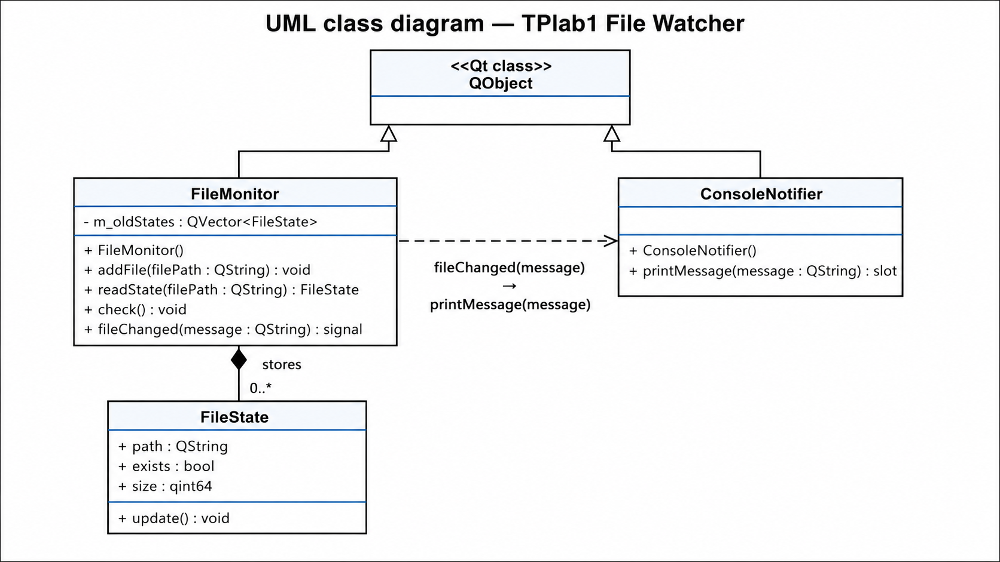

# Лабораторная № 1 - Наблюдение за файлами

## Описание

Консольное приложение на **C++ / Qt**, выполняющее наблюдение за выбранными файлами.

Программа отслеживает:

- существование файла;
- размер файла.

При изменении состояния файла выводится сообщение в консоль.

---

## Возможности

Программа умеет:

- принимать несколько путей к файлам;
- проверять, существует ли файл;
- определять размер файла;
- обнаруживать появление файла;
- обнаруживать исчезновение файла;
- обнаруживать изменение размера файла;
- выводить уведомления в консоль;
- использовать сигнально-слотовое соединение Qt;
- хранить состояния файлов в контейнере `QVector`.

---

## Используемые технологии

- C++
- Qt 5.15.2
- Qt Console Application
- QFileInfo
- QVector
- QTextStream
- Signals / Slots
- Git / GitHub


## Основные классы

### FileState

Класс хранит состояние одного файла:

```cpp
QString path;
bool exists;
qint64 size;
```

Метод:

```cpp
void update();
```

обновляет состояние файла через `QFileInfo`.

---

### FileMonitor

Класс отвечает за наблюдение за файлами.

Основные методы:

```cpp
void addFile(QString filePath);
FileState readState(QString filePath);
void check();
```

Для хранения состояний используется контейнер:

```cpp
QVector<FileState> m_oldStates;
```

При обнаружении изменения класс отправляет сигнал:

```cpp
void fileChanged(QString message);
```

---

### ConsoleNotifier

Класс отвечает за вывод сообщений в консоль.

Основной слот:

```cpp
void printMessage(QString message);
```

---

## Сигналы и слоты

В проекте используется сигнально-слотовый механизм Qt.

В `FileMonitor` объявлен сигнал:

```cpp
void fileChanged(QString message);
```

В `ConsoleNotifier` объявлен слот:

```cpp
void printMessage(QString message);
```

Соединение выполняется в `main.cpp`:

```cpp
QObject::connect(
    &monitor,
    &FileMonitor::fileChanged,
    &notifier,
    &ConsoleNotifier::printMessage
);
```

---

## Принцип работы

1. Пользователь вводит пути к файлам.
2. Каждый файл добавляется в наблюдение.
3. Для каждого файла сохраняется начальное состояние.
4. Программа каждые 100 мс проверяет файлы.
5. Если файл появился, исчез или изменил размер, выводится уведомление.

---

## Пример работы


Пример вывода:


## Сборка и запуск

1. Открыть `FileWatcher.pro` в Qt Creator.
2. Выбрать комплект сборки.
3. Выполнить `Run qmake`.
4. Собрать и запустить проект.
5. Ввести пути к файлам.
6. Для начала наблюдения ввести пустую строку.

---

## UML-диаграмма классов

На диаграмме показаны основные классы программы и связи между ними.



### Описание связей

* `FileMonitor` наследуется от `QObject`, так как использует механизм сигналов и слотов Qt.
* `ConsoleNotifier` наследуется от `QObject`, так как содержит слот `printMessage()`.
* Между `FileMonitor` и `FileState` используется композиция: `FileMonitor` хранит контейнер `QVector<FileState>` с состояниями наблюдаемых файлов.
* Между `FileMonitor` и `ConsoleNotifier` показана зависимость через сигнально-слотовое соединение: при изменении файла `FileMonitor` испускает сигнал `fileChanged(message)`, а `ConsoleNotifier` обрабатывает его в слоте `printMessage(message)`.

---

## Тестирование

Для проверки работы программы были выполнены следующие тестовые сценарии.

### Тест 1. Наблюдение за существующим непустым файлом

**Действия:**

1. Создать текстовый файл.
2. Записать в него несколько символов.
3. Запустить программу.
4. Ввести путь к созданному файлу.
5. Нажать Enter на пустой строке для начала наблюдения.

**Ожидаемый результат:**

Программа выводит, что файл существует, не является пустым, и показывает его размер в байтах.

Пример вывода:

```text
File exists
Size: 12 bytes
File is not empty
```

---

### Тест 2. Наблюдение за пустым файлом

**Действия:**

1. Создать пустой файл.
2. Запустить программу.
3. Ввести путь к этому файлу.
4. Нажать Enter на пустой строке.

**Ожидаемый результат:**

Программа выводит, что файл существует, его размер равен `0` байт, и файл является пустым.

Пример вывода:

```text
File exists
Size: 0 bytes
File is empty
```

---

### Тест 3. Наблюдение за несуществующим файлом

**Действия:**

1. Запустить программу.
2. Ввести путь к файлу, которого нет в файловой системе.
3. Нажать Enter на пустой строке.

**Ожидаемый результат:**

Программа выводит сообщение о том, что файл не существует.

Пример вывода:

```text
File does not exist
```

---

### Тест 4. Изменение размера файла

**Действия:**

1. Запустить программу.
2. Ввести путь к существующему файлу.
3. Начать наблюдение.
4. Изменить содержимое файла, например добавить текст.
5. Сохранить файл.

**Ожидаемый результат:**

Программа обнаруживает изменение размера файла и выводит сообщение со старым и новым размером.

Пример вывода:

```text
File size changed: C:/test/file.txt. Old size: 12 bytes. New size: 24 bytes.
```

---

### Тест 5. Удаление файла во время наблюдения

**Действия:**

1. Запустить программу.
2. Ввести путь к существующему файлу.
3. Начать наблюдение.
4. Удалить файл.

**Ожидаемый результат:**

Программа выводит сообщение о том, что файл исчез.

Пример вывода:

```text
File disappeared: C:/test/file.txt
```

---

### Тест 6. Появление файла во время наблюдения

**Действия:**

1. Запустить программу.
2. Ввести путь к файлу, которого ещё не существует.
3. Начать наблюдение.
4. Создать файл по указанному пути.

**Ожидаемый результат:**

Программа обнаруживает появление файла и выводит соответствующее сообщение.

Пример вывода:

```text
File appeared: C:/test/file.txt
```

---

### Тест 7. Наблюдение за несколькими файлами

**Действия:**

1. Запустить программу.
2. Ввести путь к первому файлу.
3. Ввести путь ко второму файлу.
4. Нажать Enter на пустой строке.
5. Изменить один или оба файла.

**Ожидаемый результат:**

Программа отслеживает каждый добавленный файл и выводит уведомления об изменениях для соответствующего файла.

---

### Тест 8. Корректное завершение программы

**Действия:**

1. Запустить программу.
2. Добавить один или несколько файлов для наблюдения.
3. Начать наблюдение.
4. Ввести одну из команд:

```text
exit
quit
q
```

**Ожидаемый результат:**

Программа завершает работу штатно, без использования `Ctrl + C`.

Пример вывода:

```text
Program finished correctly.
```

---

## Вывод по тестированию

В результате тестирования программа корректно обрабатывает основные состояния наблюдаемых файлов: существование файла, отсутствие файла, изменение размера, появление и удаление файла. Также реализовано штатное завершение работы программы через команды `exit`, `quit` или `q`.

